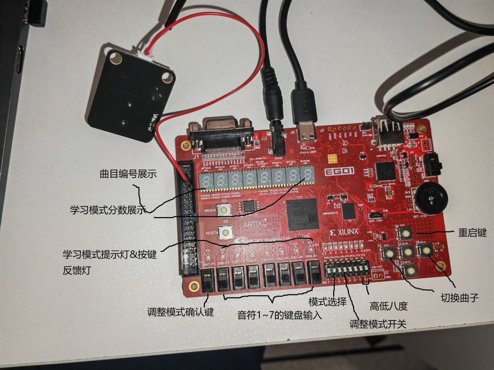

应包含 
0. 团队分工（各成员工作以及贡献百分比）【0.5】，开发计划日程安排和实施情况【1】
1. 系统功能列表 【1】
2. 系统使用说明（含系统 的输入、输出端口的说明），可参考“输入输出端口说明图示例” 示意图 【1】
2. 系统结构说明（系统内部各模块及模块间信号线的关系）【2】
3. 子模块功能说明： 输入、输出端口说明、子模块功能说明 【1】
4. bonus 的实现说明（仅对实现bonus的小组有要求，如缺少这部分，bonus总分打7折）
5. 项目总结（团队合作、开发及测试工作的总结【2】
6. 假如你们团队负责project出题，请给出基于ego1可实现的project的想法和建议，可以借鉴网上的方案，但需给出reference【1.5】）"


0.
夏辰曦： ElectronicPiano模块，自由模式基础功能与标准功能，调整模式。前期设备绑定调试，组织小组会议讨论。

日程安排：
10月初，小组会议讨论，初步分工
10~11月，自由模式基础功能与标准功能，初次上板测试。
12月10号~20号，挑战bonus功能。

1.
2.
3.

4.
5.



# Main Module

## Overview

The Main module serves as the central control unit for an electronic piano, managing different playing modes (Free Mode, Auto-Play Mode, and Learning Mode) and handling user inputs and outputs.

## Input and Output Ports

### Inputs

- `clk`: Clock signal.
- `mode_select`: Mode selection signal (0 for Free Mode, 1 for Auto-Play Mode, 2 for Learning Mode).
- `key_in`: Keyboard input (7-bit, representing different keys).
- `octave_keys`: Octave control keys (2-bit, representing octave shifts).
- `adjustment_switch`: Switch to enter adjustment mode.
- `confirm_button`: Button to confirm selections or actions.
- `next_song`: Button to select the next song.
- `prev_song`: Button to select the previous song.
- `reset`: Reset signal to initialize the module.

### Outputs

- `speaker`: Speaker output signal.
- `tub_sel_song_num`: Control signal for song number display.
- `song_num`: Song number (8-bit, displaying the current song number).
- `loud`: Volume control signal (binary signal).
- `led`: LED output (7-bit, indicating various statuses).
- `tub_sel_score1`: Control signal for score display part 1.
- `tub_sel_score2`: Control signal for score display part 2.
- `score2`: Score display (8-bit).

## Operating Modes

- **Free Mode** (`FREE_MODE`): Allows free playing of notes.
- **Auto-Play Mode** (`AUTO_PLAY_MODE`): Plays pre-set songs automatically.
- **Learning Mode** (`LEARNING_MODE`): Assists in learning songs with guided lights and scores.

## Error Handling and Boundary Conditions

- In case of invalid `mode_select` input, the system defaults to Free Mode.
- LED indicators provide visual feedback in case of errors or mode changes.
- Reset signal initializes all settings to default, ensuring recovery from any inconsistent state.

---

# AutoPlayController Module

## Overview

The AutoPlayController module automates the playback of pre-set songs, controlling song selection, playback, and related audio-visual outputs.

## Input and Output Ports

### Inputs

- `clk`: Clock signal.
- `reset`: Reset signal to initialize the module.
- `next_song`: Button to select the next song.
- `prev_song`: Button to select the previous song.

### Outputs

- `song_number`: Current song number (4-bit).
- `display_output`: Display output for the song number (8-bit).
- `speaker`: Speaker output signal.
- `note_out`: Note output signal (4-bit).
- `tub_sel`: Tube selection signal for display.
- `led`: LED output (7-bit).

## Functionality

- Manages song selection using `next_song` and `prev_song` buttons.
- Generates audio signals based on the selected song.
- Uses `SevenSegmentDecoder` to display the current song number.

## Performance and Resource Usage

- Resource-efficient design ensures minimal clock cycles per operation.
- LED indicators provide low-overhead status updates.

## Application Example

```verilog
// Instantiate the AutoPlayController in a larger system
AutoPlayController auto_play (
    .clk(clk),
    .reset(reset),
    // Other connections as per system design
);
```

---

# LearningPlay Module

## Overview

The `LearningPlay` module is designed for the learning mode of an electronic piano. It facilitates learning songs by guiding the user through song notes, showing corresponding LED indications, and providing feedback on the user's performance.

## Input and Output Ports

### Inputs

- `clk`: Clock signal.
- `reset`: Reset signal to initialize the module.
- `key_in`: Keyboard input (7-bit, representing different keys).
- `octave_keys`: Octave control keys (2-bit, representing octave shifts).
- `selected_song`: Currently selected song (4-bit, representing song number).

### Outputs

- `learn_show_led`: LED output for learning guidance (7-bit).
- `speaker`: Speaker output signal.
- `score2`: Current score display (8-bit).
- `tub_1` and `tub_2`: Control signals for score display.

## Functional Description

- Manages song playback for learning, with guided LEDs (`learn_show_led`) to indicate the current note to be played.
- Scores the user's performance based on the accuracy and timing of the played notes.
- Provides audio feedback through the speaker based on user input and the correctness of notes played.
- Displays the user's score on a 7-segment display controlled by `tub_1` and `tub_2`.

## Key Features

- **Song Playback Control**: Handles the playback of songs for learning purposes, including note timing and progression.
- **Scoring System**: Implements a scoring system based on the user's input accuracy and timing.
- **LED Guidance**: Utilizes LEDs to guide the user through the song, indicating which note to play next.
- **Dynamic Feedback**: Offers dynamic audio feedback to help the user learn and correct mistakes.

## Performance and Resource Usage

- Optimized for low resource usage, ensuring smooth operation on hardware with limited capabilities.
- Efficiently manages clock cycles for real-time performance feedback.


Absolutely! I'll create English documentation for the `ElectronicPiano` module, particularly focusing on the Free Mode, as well as provide documentation for the remaining modules. The documentation will be formatted in Markdown.

---

# ElectronicPiano Module Documentation

## Overview

The `ElectronicPiano` module serves as the primary control unit for an electronic piano system. It integrates various sub-modules to handle different functionalities, including playing notes, octave control, and adjustment mode.

## Input and Output Ports

### Inputs

- `clk`: Clock signal.
- `reset`: Reset signal.
- `adjustment_switch`: Switch to enter adjustment mode.
- `confirm_button`: Confirmation button for selections.
- `key_in`: Keyboard input (7-bit, representing different keys).
- `octave_keys`: Octave control keys (2-bit).

### Outputs

- `speaker`: Speaker output signal.
- `Input_Led`: LED indicators for key inputs (7-bit).
- `octave_Led`: LED indicators for octave keys (2-bit).
- `adjustment_switch_Led`: LED indicator for adjustment switch.
- `loud`: Volume control signal (binary signal).
- `light`: Light output for visual feedback (5-bit).

## Free Mode Operation

In Free Mode, the module allows users to play notes freely. It interprets the key inputs (`key_in`) and plays the corresponding notes through the speaker. The octave control alters the pitch of the notes played.

## Sub-Modules

### KeyboardInput

Handles the mapping of keyboard inputs to musical notes.

### AdjustmentModeControl

Manages the adjustment mode where users can customize key mappings and settings.

### Buzzer

Generates audio signals corresponding to the musical notes.

### OctaveControl

Controls the octave shifts for playing higher or lower pitches.

## Performance and Resource Usage

- Designed for efficiency, ensuring minimal latency in note playback.
- LED indicators provide real-time feedback with minimal resource consumption.
---

# KeyboardInput Module Documentation

## Overview

The `KeyboardInput` module maps physical keyboard inputs to corresponding musical notes. It supports standard and custom mappings for note playback.

## Input and Output Ports

### Inputs

- `key_in`: Keyboard input (7-bit).
- `note_ad`: Note adjustment input (4-bit).
- `key_mapping_0` to `key_mapping_6`: Custom key mappings for notes 0 to 6 (7-bit each).
- `adjustment_mode`: Adjustment mode signal.

### Output

- `note_out`: Note output (4-bit).

## Functionality

- Translates key presses into musical notes based on the current key mapping.
- Supports an adjustment mode for customizing key-to-note mappings.

# OctaveControl Module Documentation

## Overview

`OctaveControl` manages octave shifting in the electronic piano, allowing the user to play notes in different octaves.

## Input and Output Ports

### Inputs

- `octave_keys`: Octave control keys (2-bit).

### Outputs

- `octave_up`: Octave up control signal.
- `octave_down`: Octave down control signal.

## Functionality

- Adjusts the pitch of the notes played by shifting the octave up or down.
- Responsive to real-time user inputs for octave adjustments.

## Application Example

```verilog
// Instantiate the OctaveControl module
OctaveControl octave_control (
    .octave_keys(octave_keys),
    // Other connections as needed
);
```

---

# AdjustmentModeControl Module Documentation

## Overview

The `AdjustmentModeControl` module facilitates customization of key mappings and settings in the electronic piano.

## Input and Output Ports

### Inputs

- `clk`: Clock signal.
- `reset`: Reset signal.
- `adjustment_mode`: Signal to activate adjustment mode.
- `confirm`: Confirmation button signal.
- `key_in`: Keyboard input for custom mapping.

### Outputs

- `note_to_play`: Note to be played during adjustment (4-bit).
- `key_mapping_0` to `key_mapping_6`: Customizable key mappings (7-bit each).
- `light`: Light output for visual feedback (5-bit).

## Functionality

- Allows users to customize key-to-note mappings.
- Provides a guided interface with visual feedback for setting adjustments.
